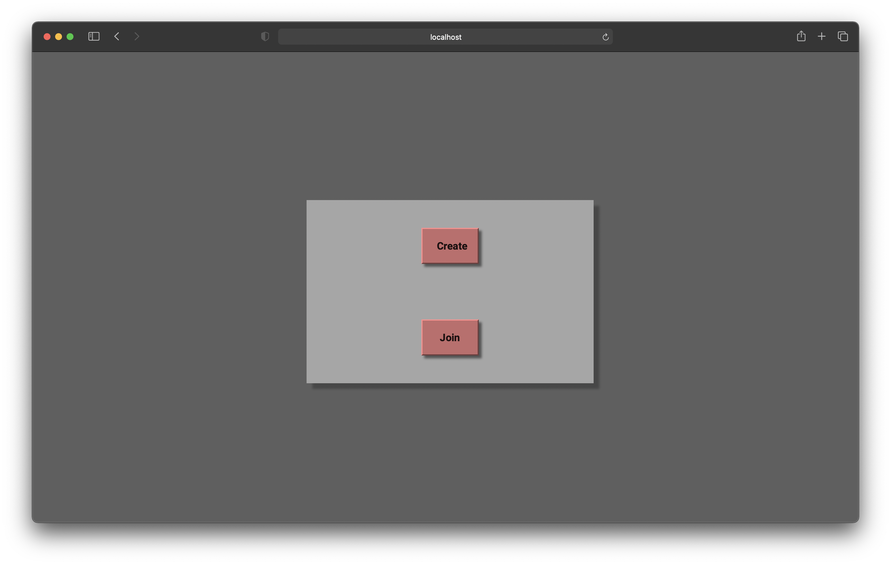

<h1>Multiplayer Tiles Game &nbsp;   &nbsp; </h1>

---

This game allows different players to join an game an play. It maintains the connection in realtime using websockets.

#### Note

> This is the initial stable version of the Game.  
> My intention is to look at the functionality of websockets.  

#### Preview

#### Requirements

Nodejs, websocket, express

##### To clone this repository

> `git clone https://github.com/reach-the-sky/Multiplayer-Tiles-Game.git`

If you liked my project and appreciate the content I opensource, consider following me on github [🌥](https://github.com/reach-the-sky).
